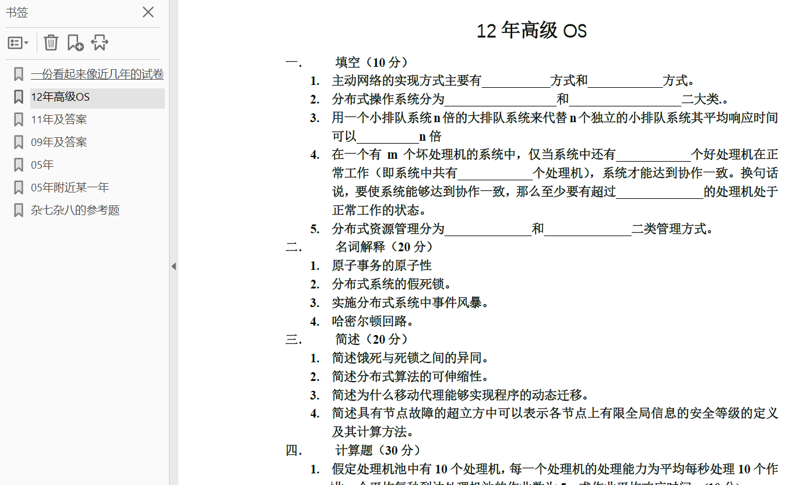

# Distributed-Operating-System
高级操作系统，熊焰&amp;黄文超老师，中科大研究生课程

这里存放了：

1. 我的课程笔记

   

2. 试卷

   

---

【2020年期末】

题型：填空，名词解释，简答，计算，算法

部分回忆：

由于移动代理，主动网络，云计算没时间上了，让自己看的笔记，所以这部分只考了一道简答：云平台的作用是什么？

简答：

- 拜占庭将军问题

- 逃逸信道

计算：

1. 处理池模型平均响应时间$1/n(\mu-\lambda)$。

2. 虚网络2D mesh高低子网双路径路由。

算法：

1. 哲学家就餐死锁和饿死避免。

2. 超立方修改的基于安全等级的容错多播算法（MSLBM算法），给了四维超立方中的src, dst，还有出错点，1）算节点安全等级，2）求路由路径。

   （这个算法必考）

